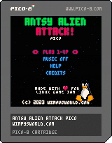

<h1 align="center">
  
  <br />
  Antsy Alien Attack Pico 👾🛸💥
</h1>
<div align="center">
<a href="https://wimpress.itch.io/antsy-alien-attack-pico" target="_blank"></a>
<a href="https://snapcraft.io/antsy-alien-attack-pico"></a>
</div>

# Plot

Antsy Alien Attack Pico is a retro-style vertically scrolling shoot 'em up.

> **The year is 2139. Planet Earth is under attack by aliens, and they're (still) antsy!**

## Objective

🚀 **You're a mercenary** with a state-of-the-art space fighter and a gun for hire
👾 The United Federation of Planet Earth has hired you to **dispatch the aliens and restore calm**
💰️ **Complete every mission** to fulfil your contract and earn your pay

### One ship. One life. One mission.

💥 Destroy aliens by **shooting, colliding with them or using smart weapons**
🛸️ **Avoid the aliens** if you can't destroy them
🔋 Collect power-ups to **charge the ship dynamo** and enhance your weapons
🛡️ A fully charged **dynamo boosts ship health by 50%**
🛑 **Weapons go offline** when travelling at hyperspeed
🌌 When your shields are depleted, **you're lost to the vacuum of space**

## Controls 🕹️

**Antsy Alien Attack Pico should work with most game controllers** 🎮️ The in-game visuals show the PICO-8 buttons, but the following shows the equivalent buttons for Xbox controllers.

| Action    |  Button / Stick  |
|:---------:|:-----:|
| Move      |  |
| Fire      |  |
| Generator |  |

### 1-UP Keyboard 1️⃣

| Action    |  Key(s) |
|:---------:|:-----:|
| Left      |  |
| Right     |  |
| Up        |  |
| Down      |  |
| Fire      |  |
| Generator |  |

### 2-UP Keyboard 2️⃣

| Action    |  Key(s) |
|:---------:|:-----:|
| Left      |  |
| Right     |  |
| Up        |  |
| Down      |  |
| Fire      | |
| Generator | |

# Install

## Debian/Ubuntu

Download the `.deb` package from Itch.io and install it using `apt-get`:

```bash
apt-get install ./antsy-alien-attack-pico_0.23.145_amd64.deb
```

## Snap

```bash
snap install antsy-alien-attack-pico
snap connect antsy-alien-attack-pico:joystick
```

## Other Linux

Download the Linux `.zip` from Itch.io, extract it and then run `./antsy-alien-attack-pico` from a terminal. **You will also need to install the SDL2 package for your distribution.**

# Game design 📐

Antsy Alien Attack Pico is a *"sequel"* to [Antsy Alien Attack](https://github.com/wimpysworld/antsy-alien-attack). Antsy Alien Attack Pico was developed during [Linux Game Jam 2023](https://itch.io/jam/linux-game-jam2023) 🐧 using [PICO-8](https://www.lexaloffle.com/pico-8.php). I've been looking for an excuse to learn PICO-8 and this is it!

- Vertical shooter
- 1-UP or 2-UP
- 5 waves each with distinct mini-games
- ~~Post-wave status report~~
- 5 (or more) distinct alien enemies
- 1 life governed by HP meter
- Mini-games between waves
  - Asteroid belt - Go fast, don't die
  - Power spree - A few seconds to grab fast-moving power-ups
    - Both run at hyper-speed with no weapons
  - None shall pass - don't miss any aliens
  - Cargo escort - protect the cargo ship
- "Juice"
- Publish Linux builds
 - `.deb`, Snap and Flatpak

## Pickups ⚡️

- Weapon upgrades
  - Faster speed
  - Shorter cool down
  - More damage
  - Wider spray patterns
- Shields
- Weapons block
  - Wipeout alien projectiles and prevent fire for some seconds
- Smartbomb
  - Damage all aliens and wipeout all alien projectiles
- Power
  - Charges the dynamo
  - A fully charged dynamo yields player HP
  - ~~Hold the second button to release a smart bomb~~; playtesters didn't think this added anything of value

## Technical considerations 🧠

- 1-UP accent is green, 2-UP accent is red
- Alien projectiles will always be yellow/orange
- Subtle parallax starfield backdrop
  - Helps make projectiles visible
  - More sprites for actors and projectiles
- Minimal player HUD due to 128x128
- Target 60FPS on low-power handhelds
- Use particle system to overcome sprite bank limits
- Use palette swaps to overcome sprite bank limits
- Hitbox collision detection to preserve performance budget

## Risks 🚨

- Time
- pico-8 token limit; *the struggle is real*
- pico-8 performance budget; *turns out this is not such a big concern*
- Flatpak and publishing in Flathub
- Level "design"
- Time
- Juicy enough
- pico-8 sprite bank size; *is plenty if your games doesn't use tiles*
- Finding suitable sfx and gfx
- pico-8 optimisations create ugly code 🍝
- Time

## Outcomes 🤞

- Reference for packaging/distributing pico-8 games to Linux users
- pico-8 tooling to use for making more games
- Learn some basic juicing and game-feel mechanics
- Fun

## Credits 🙇 & Licenses 👨‍⚖️

A big *"Thank you!"* to everyone below who contributed to the making Antsy Alien Attack Pico during the game jam. Antsy Alien Attack Pico would have been boring shapes and silence had it not been for these fine people:

The game code is licensed under the [MIT license](https://en.wikipedia.org/wiki/MIT_License) and all game assets are licensed using [CC-BY-NC-SA 4.0](https://creativecommons.org/licenses/by-nc-sa/4.0/). As I'm using assets from other creators, and they use the CC-BY-NC-SA 4.0 license, the few SFX and sprites I created are also released under the CC-BY-NC-SA 4.0 to keep things simple.

- The player ship is from [Krystian Majewski](https://www.lexaloffle.com/bbs/?uid=16423) [CC-BY-NC-SA 4.0]
- Most of the other sprites are created by [Alice Masters](https://linktr.ee/alethium_art) [CC-BY-NC-SA 4.0]
- All the music is from [Gruber](https://www.lexaloffle.com/bbs/?uid=11292) [CC-BY-NC-SA 4.0]
- Most of the SFX are from [Gruber](https://www.lexaloffle.com/bbs/?uid=11292) [CC-BY-NC-SA 4.0]

# Task List

10 Days! Welp 😅

- 🪵 [**DevLog**](https://itch.io/jam/linux-game-jam2023/topic/2880148/devlog-antsy-alien-attack-pico-)

## Engine ⚙️

- [x] Text renderer
- [x] State system
- [x] Actors object
- [x] Weapons object
- [x] Super simple sprite system with collision detection
- [x] Bitwise controller system
- [x] uint32 handler
- [x] SFX channel dispatcher
- [x] [fake-08](https://github.com/jtothebell/fake-08) compatibility

## Menus & Game State 🎛️

- [x] Main screen with Tux
- [x] Credits
- [x] Help
- [x] Game Over
- [x] Game Win
- [x] Toggle music
- [x] Persist Hiscore

## Juice 🧃

- [x] Particle system
- [x] Screen shake

## Build tools 🛠️

- [x] Linux, Raspberry Pi, Windows, & macOS binaries
- [x] `.deb`
- [x] Snap
- [ ] Flatpak (*stretch goal*)
- [ ] AppImage (*stretch goal*)

## Player 🚀

- [x] Controls and movement
- [x] Collider handling
- [x] HUD

### Weapons upgrades

| Level | Speed | Cooldown | Damage | Pattern |
|:-----:|:-----:|:--------:|:------:|:--------|
| 1     | 4     | 4.5      | 7      | Dual    |
| 2     | 2.75  | 5.5      | 8      | 3-way   |
| 3     | 2     | 6.5      | 9      | 4-way   |
| 4     | 1.75  | 7.5      | 10     | 5-way   |

## Pickups

- [x] Shields
- [x] ~~Speed~~; playtesting feedback was this was "Meh" and didn't add anything to the game
- [x] Weapon patterns; more devastation
- [x] Weapons block; wipeout alien projectiles and prevent fire for some time
- [x] Smartbomb; damage all aliens and wipeout all alien projectiles
- [x] Power; charges the generator.
- [x] HP; adds to ship HP

## Aliens 👾

- Shot damage is 10 across the board for all aliens at the moment.
- Each alien yields points when destroyed that is calculated as `(HP + COLLISION_DAMAGE * 100) + EXPLOSION_SIZE`

| Class           |  Speed  | Trajectory             | Fire Pattern            | Bull. Size |  HP  | Coll. Damage | Exp. Size | Status |
|:---------------:|:-------:|:----------------------:|:-----------------------:|:----------:|:----:|:------------:|:---------:|:------:|
| Drone           | Slow    | Wave                   | Single on line of sight | Small      |  20  | 20           | 1         | Done   |
| Asteroid Grey   | Slow    | Single path            | n/a                     | n/a        |  50  | 30           | 2         | Done   |
| Asteroid Brown  | Medium  | Single path            | n/a                     | n/a        |  35  | 20           | 1         | Done   |
| Orby            | Medium  | Vertical               | 8-way Pulse             | Small      |  40  | 20           | 1         | Done   |
| Bronze          | Slow    | Converge center        | Opposite corner         | Medium     |  40  | 20           | 1 or 2    | Done   |
| Silver          | Medium  | Vertical               | Aimed                   | Small      |  45  | 20           | 2         | Done   |
| Sapphire        | Medium  | Diagonal               | Predictive              | Small      |  50  | 20           | 2 or 3    | Done   |
| Emerald         | Fast    | Wide wave              | 4-way Spread            | Medium     |  60  | 20           | 3         | Done   |
| Saucer          | Fast    | Swoop and retreat      | 360° Spiral             | Large      |  75  | 40           | 3         |        |

### Boss patterns

- tbd

## Waves 🌊

### Level 1

- Drone
- Bronze
- Silver
- Asteroid Belt Slow Weapons On
- Sapphire
- Emerald

### Level 2

- Bronze Scouts
- Silver Scouts
- Some Can Pass
- Bronze Scouts
- Spheres
- Metal Squad
- Asteroid Belt Fast Weapons Off

### Level 3

- Sapphire Scouts
- Emerald Scouts
- Evade Spheres Fast Weapons Off
- Metal Squad
- Spheres
- Gem Squad
- Asteroid Belt Slow Weapons On

### Level 4

- Bronze Scouts
- Silver Scouts
- Sapphire Scouts
- Emerald Scouts
- None Shall Pass
- Metal Squad
- Gem Squad
- Asteroid Belt Fast Weapons Off

### Level 5

- Armada
- Some Can Pass
- Armada
- Asteroid Belt Slow Weapons On
- None Shall Pass
- Armada

### Mini-Games 🗺️

- [x] Asteroid belt - Go fast, don't die
- [x] Power spree - A few seconds to grab fast-moving power-ups
- [x] None shall pass - don't miss any aliens
- [x] Some can pass - try to stop them all
- [x] Cargo escort - protect the cargo ship
- [ ] Push 'em back - push the aliens back into the obliterator
- [x] Rock on - more rocks than you can avoid
- [x] Quick draw - Shoot fast moving aliens within a tight time limit
- [ ] Peekaboo - Aliens appear briefly, fire and leave
- [ ] ~~Canyon run - narrow canyon with lots of rocks at speed (*stretch goal*)~~
- [ ] ~~Tunnel through - make a path through the rocks (*stretch goal*)~~

## Publishing 🕹️

- [x] GitHub page
- [x] Itch.io page
- [x] Snapstore page
- [ ] Lexaloffle BBS page

## Stretch Goals 💪

- [x] Training missions; first missions teach you how to play
- [ ] ~~Player performance/skill tracking with post-wave report~~
- [ ] Publish in Flathub page
- [ ] ~~Predictable wave patterns/timings~~
- [ ] ~~Sprite rotation and zooming~~
- [ ] ~~Ship velocity/friction~~
- [ ] Scene change transitions/wipes
- [x] Player formation "animations"
- [ ] Player gravity-guided pick-ups
- [x] Pick-up animations
- [x] HUD orientation
- [ ] ~~Player smart bomb is homing missiles~~

# Development tools 🧑‍💻

All development was done on Linux workstations, running either [NixOS](https://nixos.org) ❄️  or [elementary OS](https://elementary.io/). I decided to use pico-8 directly for all development, and the following tools to help with the process:

- [PICO-8 CRT effect HTML template](https://github.com/carlc27843/pico8-crt-plate)
- [Renoiser](https://www.lexaloffle.com/bbs/?tid=36922)
- [respriter](https://www.lexaloffle.com/bbs/?tid=35255) (*I didn't use this in the end*)

# Graphics Discovery 🖌️

Think about portability to 8x8 or 16x16 sprites with the fixed pico-8 16 colour palette. I found these, most are not suitable for pico-8 😭 Thankfully Alice Masters helped out.

- <https://opengameart.org/content/modular-ships>
- <https://opengameart.org/content/1616-ship-collection>
- <https://opengameart.org/content/bullet-collection-2-m484-games>
- <https://opengameart.org/content/shmup-ships>
- <https://opengameart.org/content/space-ship-shooter-pixel-art-assets>
- <https://opengameart.org/content/retro-spaceships>
- <https://opengameart.org/content/space-war-man-platform-shmup-set>
- <https://opengameart.org/content/super-dead-space-gunner-merc-redux-platform-shmup-hero>
- <https://opengameart.org/content/some-invaders>

# Music Discovery 🎹

[Gruber](https://www.lexaloffle.com/bbs/?uid=11292) has two carts with music selection that can be used in games. This is what I've picked:

## From [Pico-8 Tunes Vol. 1](https://www.lexaloffle.com/bbs/?tid=29008)

1. pat 00 - 05
2. pat 06 - 13
3. pat 14 - 17
4. pat 18 - 23  Use as Game Theme
5. pat 24 - 29
6. pat 30 - 35
7. pat 36 - 41
8. pat 42 - 45	Use as Boss Fight
9.  pat 46 - 47
10. pat 48 - 54
11. pat 55 - 58
12. pat 59 - 63

## From [Pico-8 Tunes Vol. 2](https://www.lexaloffle.com/bbs/?tid=33675)

1. pat 00 - 06  Use as Game Win
2. pat 07 - 12
3. pat 13 - 20  Use as In Game
4. pat 21 - 30
5. pat 31 - 39
6. pat 40 - 42
7. pat 43 - 48  Use as Game Over (not enough instrument space)
8. pat 49 - 55
9. pat 56 - 61  Use for Asteroids (not enough instrument space)

## Music patterns

I used [Renoiser](https://www.lexaloffle.com/bbs/?tid=36922) to make a new cart with the following music patterns. Not feasible to add music for the asteroid belt, there would not be sufficient SFX slots left over.

- pat 0  - Attract
- pat 6  - In Game
- pat 14 - Boss Fight
- pat 18 - Game Win

# SFX Discovery 🔊

SFX 35 to 63 are free after the music is added. Only two channels are available for SFX so none of them can be particularly long-running and I'll need to manage the channel usage dynamically.

[Gruber](https://www.lexaloffle.com/bbs/?uid=11292) also has a [Pico-8 SFX Pack](https://www.lexaloffle.com/bbs/?tid=34367) he's created for various pico-8 games.

## SFX slots and origins

Here are the SFX slot numbers and what the corresponding SFX is used for. Any that start with "From" indicate which slot in the Pico-8 SFX Pack they were sourced from.

- 0 : UI Move          : From 8
- 1 : UI Action        : From 11
- 2 : 1-UP Fire        : Mine
- 3 : 2-UP Fire        : Mine
- 4 : Alien Fire       : Mine
- 5 : Hit              : Mine
- 6 : Explosion 1      : From 21
- 7 : Explosion 2      : From 25
- 8 : Explosion 3      : Mine
- 9 : Pickup Item      : From 56
- 10: Shields Up       : From 48
- 11: Generator Power  : From 51
- 12: Smartbomb        : From 45
- 13: Weapons Disabled : From 40
- 14: HP Power-Up      : From 4
- 15: Battery Power-Up : From 6
